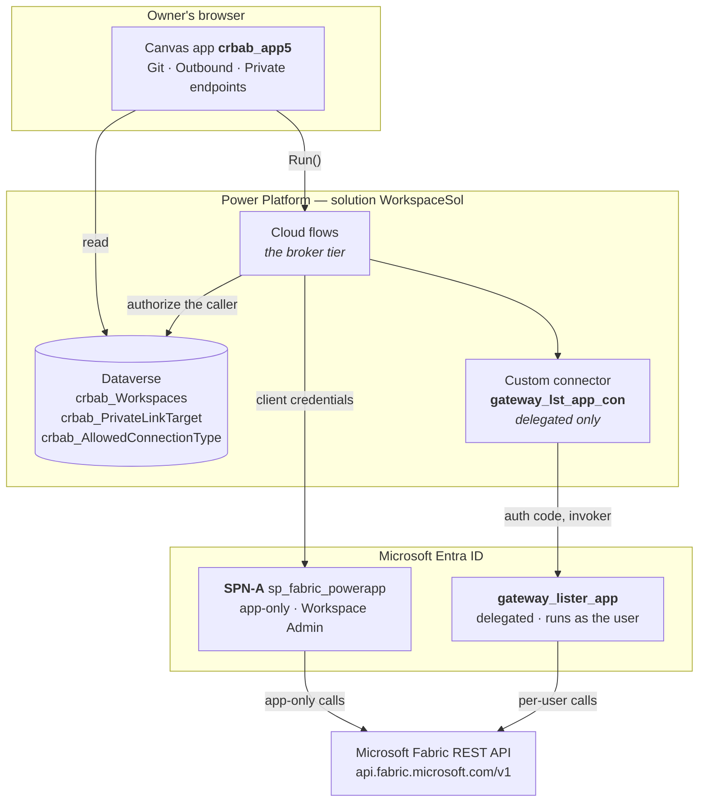
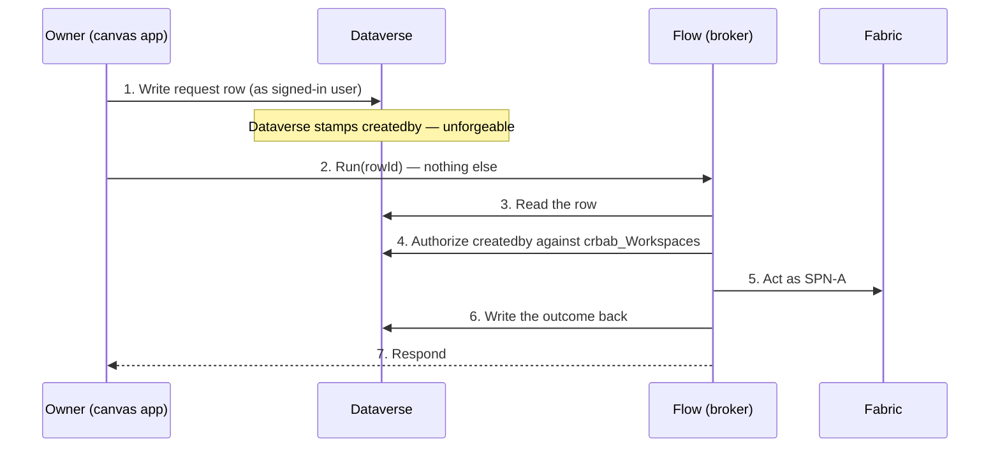
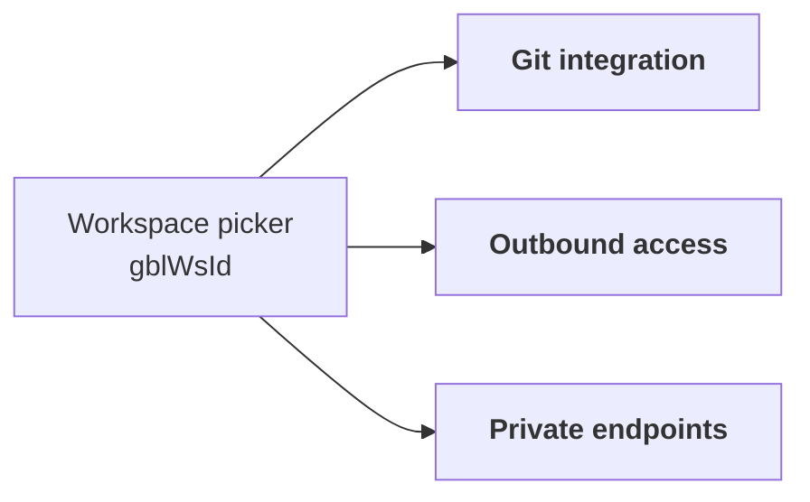
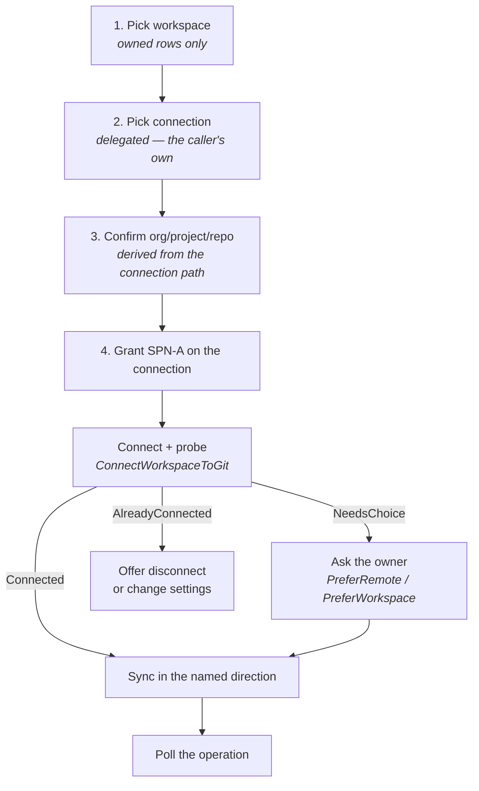
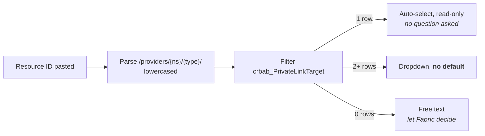

# High-level architecture

A single-page view of the **Fabric Workspace Settings** app: what it is, who it runs as, what it is made of, and how a request travels from an owner's click to a Fabric REST call.

Detail lives elsewhere and is linked from each section. Start here, then go deep.

> **Scope.** This document covers the workspace-settings app only — Git integration, outbound access, and managed private endpoints. The capacity-scoped `ItemCreation` policy work is a **separate system** governing capacities rather than workspace settings; it is out of scope here and documented on its own.

---

## Contents

| § | Section | Read it for |
|---|---|---|
| 1 | [The problem in one paragraph](#1-the-problem-in-one-paragraph) | Why a broker exists at all |
| 2 | [The shape of the system](#2-the-shape-of-the-system) | The four tiers and what each is responsible for |
| 3 | [Identity model](#3-identity-model) | SPN-A vs. delegated, and when each is used |
| 4 | [Authorization boundary](#4-authorization-boundary) | Why Dataverse decides, and the audit-row write pattern |
| 5 | [The app — three tabs](#5-the-app--three-tabs) | What owners actually see and do |
| | &nbsp;&nbsp;[5.1 Git integration](#51-git-integration) | The connect wizard and why it probes first |
| | &nbsp;&nbsp;[5.2 Outbound access](#52-outbound-access) | OAP settings, and why they hide when OAP is off |
| | &nbsp;&nbsp;[5.3 Private endpoints](#53-private-endpoints) | The two status fields, and picking a sub-resource |
| 6 | [Flow inventory](#6-flow-inventory) | Every flow, its identity and its job |
| 7 | [Data model](#7-data-model) | The four tables, and what is deliberately not cached |
| 8 | [**Permissions and access**](#8-permissions-and-access) | Who holds which rights |
| | &nbsp;&nbsp;[8.1 The workspace owner](#81-the-workspace-owner--the-end-user) | What an end user needs — and conspicuously does not |
| | &nbsp;&nbsp;[8.2 SPN-A — the broker](#82-spn-a--the-broker) | What the broker needs, and what it must never be given |
| | &nbsp;&nbsp;[8.3 The delegated app](#83-the-delegated-app--gateway_lister_app) | The three scopes and the consent trap |
| | &nbsp;&nbsp;[8.4 Azure](#84-azure--nobody-on-our-side) | Why nobody on our side needs Azure RBAC |
| | &nbsp;&nbsp;[8.5 Administrative roles](#85-setting-it-up--administrative-roles) | Who has to perform the setup |
| 9 | [**Prerequisites — in order**](#9-prerequisites--in-order) | The 20 numbered steps, start to finish |
| | &nbsp;&nbsp;[Entra ID](#entra-id) · [Fabric tenant](#fabric-tenant) | Steps 1–7, one-time per tenant |
| | &nbsp;&nbsp;[Power Platform](#power-platform--per-environment) | Steps 8–17, every deployment |
| | &nbsp;&nbsp;[Per workspace](#per-workspace--recurring) | Steps 18–20, recurring |
| 10 | [Conventions that keep biting](#10-conventions-that-keep-biting) | Cheap to follow, expensive to rediscover |
| 11 | [Where to go next](#11-where-to-go-next) | Which document answers which question |

**If you are onboarding a new tenant, §9 is the whole job.** §8 explains why each step is there.

---

## 1. The problem in one paragraph

Roughly **4000 Fabric workspaces**. Their owners need to configure Git integration, outbound access rules and private endpoints for the workspaces they own — but every one of those operations requires the Fabric **Workspace Admin** role, which owners do not have and will not be granted. Owners are Contributors. Handing out Admin would give each of them the ability to reconfigure any workspace they can reach.

The answer is a **broker**: a Power Platform app that performs the privileged calls through a service principal, and uses **Dataverse as the authorization boundary** to decide whether the caller is entitled to the workspace they are asking about.

The design principle that follows from this, and that recurs throughout: **broker only what genuinely needs Admin, and leave everything else in the Fabric UI where the owner already has rights.** Confirming that for Git integration removed four planned flows and two planned tables — Contributors can already commit, update from Git and view status themselves.

---

## 2. The shape of the system

Four tiers, each with one job:

| Tier | Responsibility |
|---|---|
| **Canvas app** | Presentation, workspace selection, and every decision that needs the owner's judgement. Holds no credential |
| **Cloud flows** | The broker. Acquire a token, authorize the caller against Dataverse, call Fabric, translate the result into a flat string response |
| **Dataverse** | The authorization record and the reference data. The only place that can answer "does this user own this workspace?" |
| **Custom connector** | Delegated Fabric calls — and *only* those. Every app-only call bypasses it entirely |

---

## 3. Identity model

Two identities, deliberately separated, because they answer two different questions.

| | **SPN-A** — `sp_fabric_powerapp` | **`gateway_lister_app`** |
|---|---|---|
| Flow | App-only, client credentials | Delegated, runs as the signed-in user |
| Holds | Workspace **Admin** on all managed workspaces | Whatever the caller holds |
| Used for | Every privileged write and most reads | Calls whose *answer depends on who is asking* |
| Reached via | `GetFabricToken` child flow | The custom connector, `runtimeSource: invoker` |

**When delegation is unavoidable** — and it is only ever for one of two structural reasons:

1. **The data is per-user.** `ListMyConnections` and `ListGateways` must return the caller's own list. SPN-A's list is not the caller's list.
2. **The right is per-user.** `AddConnectionRoleAssignment` grants SPN-A access to a connection the owner created. An SPN cannot grant itself a role on someone else's connection; only the connection Owner can.

Everything else brokers through SPN-A. Managed private endpoints are the clean illustration: they are workspace-scoped objects with no per-user view, and their writes need Admin — so a delegated create would return `403` for every single user of the app. Brokering is not the preferred design there, it is the only one that works.

### Fabric access is not granted by app permissions

Confirmed by testing. A token with an empty `roles` claim is normal and works fine; adding application permissions in the app registration does nothing. SPN-A's Fabric access requires **all three** of:

1. Membership of the Entra group `fabric_power_app_grp`
2. Fabric tenant setting **"Service principals can call Fabric public APIs"**, enabled and scoped to that group
3. A Fabric-side role on the target object — workspace, gateway or connection

This is a hard prerequisite for every app-only flow and is **environment-specific**: the group and the tenant setting must be recreated in every tenant the solution is deployed to. A bare `401` on every call means one of the first two is missing; a `403` means both are satisfied and only the object role is absent.

The full permission picture — for the owner, the broker, the delegated app and the administrators who set it all up — is in §8.

### Git credentials belong to the owner

The app never holds Git credentials. Owners create their own *Azure DevOps – Source Control* connection; SPN-A is granted the `User` role on it and references it by ID, never seeing the secret. A consequence worth stating to owners: **ADO records the commit as pushed by the connection's identity, not the requester** — so a connection built on a service principal outlives the person who made it, and one built on a personal account does not.

---

## 4. Authorization boundary

Fabric cannot answer the ownership question. Owners hold no Fabric role, so `roleAssignments` on a workspace returns nothing useful about them. The ownership record therefore lives in Dataverse, in **`crbab_Workspaces`**, and every flow that acts on a workspace must confirm the caller appears there as primary or secondary owner — and **fail closed** if not.

### Why writes cannot trust their own trigger

A Power Apps (V2) trigger receives the user identity as a *parameter*. Anyone who can reach the flow URL can forge it. That is acceptable for a read and not acceptable for a write.

Writes therefore use the **audit-row pattern**:

Identity is trusted because of **where it was read from**, not because of who called. The flow keeps its Power Apps trigger, so the app still gets an immediate answer.

Two deliberate exceptions:

- **Read flows** may stay on a plain Power Apps trigger with no row at all.
- **`AddConnectionRoleAssignment` is self-authorizing.** The Fabric API only lets a caller grant roles on a connection they already control, so the boundary is enforced by the API itself.

> The ownership check gates general availability. Until it is in place, each write flow acts on whatever `workspaceId` it is handed — which is why the app's audience is currently the build team. It must land before the app is shared, and it is a prerequisite for the private-endpoint writes in particular: a create sends a request that leaves Fabric entirely, and a delete breaks a live data path with a cooldown before it can be undone.

---

## 5. The app — three tabs

`Form Screen` holds a tab bar driven by `varActiveTab`, with sibling containers whose `Visible` tests it. Each tab is independent: its own load block, its own error banner, its own collections.

`gblWsId` is set before anything else and gates every tab. No workspace, no tab.

### 5.1 Git integration

Brokers exactly two operations — **connect** and **disconnect** — because those are the only Git actions a Contributor cannot already perform in the Fabric UI. There is no update API for a Git connection, so **changing a branch or directory is disconnect + reconnect**, which the same two flows cover.

The connect path is a wizard, and its shape is driven by one insight: *the owner cannot sensibly choose an initialization strategy before anyone knows whether both sides hold content.* So the app connects first, asks Fabric what it wants done, and only raises the question if Fabric refuses to guess.

Two structural choices worth carrying in your head:

- **The role grant happens on the final step**, immediately before the write. An abandoned wizard leaves no stray role assignments behind.
- **Connect and sync are two flows, not one.** By the time content moves, the workspace is already connected — calling `connect` again would fail. Splitting them also keeps each run inside the 120-second response budget a Power Apps call allows.
- **Org, project and repo are derived**, never pasted. They come out of `connectionDetails.path` on the connection the owner picked.

### 5.2 Outbound access

Reads and writes the workspace's outbound communication policy: allowed connections, allowed gateways, and whether Git integration is permitted outbound.

Everything on this tab lives under `networking/communicationPolicy/outbound/*` — these are Outbound Access Protection's own settings. **When OAP is off they are inert**, so the tab shows nothing but the OAP state readout and an explanation.

That is a correctness requirement, not tidiness: with OAP off there is no outbound restriction at all, so a greyed-off *Allow Git integration* toggle and an empty *Allowed gateways* list both tell the owner the exact opposite of the truth about their workspace's posture. Hide, don't disable.

`GetOutboundRules` returns an **ETag** that `SetOutboundRules` must echo — optimistic concurrency, so two owners editing at once cannot silently overwrite each other.

### 5.3 Private endpoints

Manages the workspace's **managed private endpoints** — the outbound private-link connections Fabric uses to reach data sources that are not publicly reachable. Three operations: list, create, delete.

Structurally the simplest tab in the app: three HTTP calls on one resource, all app-only, all covered by a role the broker already holds. **No connector change, no new scope, no re-consent, no new Fabric permission, and no Azure RBAC at all** — the Azure-side rights sit entirely with the *approver* on the far end, which is what makes the feature deployable across 4000 workspaces without any Azure onboarding.

**Two independent status fields, and the tab shows both.** Conflating them is the likeliest design mistake here:

| Field | Owned by | Answers |
|---|---|---|
| `provisioningState` | **Fabric** | Did Fabric manage to create the endpoint |
| `connectionState.status` | **The data source admin, in the Azure portal** | Has the far end accepted the request |

`Succeeded` + `Pending` is the **normal steady state** for minutes to days after creation, and the endpoint is unusable until it reaches `Approved`. The tab must not present that as an error. `connectionState` is also genuinely absent on a freshly created row, so every read of it must be null-safe.

#### Picking the sub-resource

A private endpoint targets a resource *and a sub-resource* — Azure's private-link group ID. One storage account needs **separate endpoints for `blob` and `dfs`**, each approved separately.

The sub-resource is a property of the resource *type*, not the resource, so the app parses the type out of the resource ID and filters a Dataverse lookup table on it:

Around fifteen types resolve 1:1. Five are genuinely ambiguous — storage, Cosmos DB, Synapse, Purview and Databricks — where the ID cannot distinguish the options and only the owner knows which one their work needs.

**There is deliberately no default on that dropdown**, and the reason is the sharper of the two failure modes:

| Failure | What happens |
|---|---|
| Sub-resource **invalid** for the type | Fabric accepts the `POST` with `201` — it does not validate — then provisioning fails. Visible: the row shows `Failed`, the owner deletes and recreates |
| Sub-resource **valid but not the one needed** | Provisions to `Succeeded`, gets approved, `connectionState` reads `Approved` — **and the workload still fails**, because its traffic goes to a hostname this endpoint does not cover. Every signal the app can see says success |

The second one is why the picker constrains rather than guesses, and why the app always re-lists after a create: `outcome: Created` means the request was accepted, not that the endpoint works.

An endpoint that shows `Failed` needs no diagnosis and no support ticket — it means the sub-resource was wrong. Delete it and create the right one.

---

## 6. Flow inventory

All flows live in `Workflows/` as unpacked solution JSON, edited in the maker portal and re-exported. **Never hand-edited.**

### Git integration

| Flow | Identity | Purpose |
|---|---|---|
| `GetFabricToken` | — | Child flow. The single place SPN-A's client-credentials block exists |
| `GetWorkspaceGitState` | SPN-A | Read the current connection so the tab knows what to offer |
| `ListMyConnections` | **delegated** | The caller's own ADO connections, filtered client-side |
| `AddConnectionRoleAssignment` | **delegated** | Grant SPN-A the `User` role on the owner's connection |
| `ConnectWorkspaceToGit` | SPN-A | Stage 1 — connect, then probe for the required direction |
| `SyncWorkspaceWithGit` | SPN-A | Stage 2 — move the content |
| `DisconnectWorkspaceFromGit` | SPN-A | Disconnect. Also the only route to a branch or directory change |
| `GetGitOperationStatus` | SPN-A | Report the state of a long-running operation. Advances nothing |

### Networking

| Flow | Identity | Purpose |
|---|---|---|
| `GetOAPSetting` | SPN-A | Is Outbound Access Protection on |
| `GetOutboundRules` / `SetOutboundRules` | SPN-A | Allowed outbound connections, with ETag concurrency |
| `GetGatewayRules` / `SetGatewayRules` | SPN-A | Allowed gateways |
| `GetGitPolicy` / `SetGitPolicy` | SPN-A | Outbound Git permission |
| `ListGateways` | **delegated** | Gateways the caller can actually see |

### Private endpoints

| Flow | Identity | Purpose |
|---|---|---|
| `ListPrivateEndpoints` | SPN-A | Paged read of the workspace's endpoints |
| `CreatePrivateEndpoint` | SPN-A | Request a new endpoint. Returns `201` immediately, no polling |
| `DeletePrivateEndpoint` | SPN-A | Remove one |

`GetFabricToken` is a child flow and is never added to the canvas app. Every other flow the app calls is added to it explicitly.

---

## 7. Data model

| Table | Role |
|---|---|
| `crbab_Workspaces` | **The authorization boundary.** Workspace ID plus primary and secondary owner. Populated externally |
| `crbab_AllowedConnectionType` | Reference data for the outbound tab |
| `crbab_PrivateLinkTarget` | Resource type → valid private-link sub-resources. One row per pair, seeded from `data/PrivateLinkTargets.csv` |
| `crbab_GitAuditLog` | Who did what, when, and with what outcome — and the row that carries unforgeable identity into a write flow |

Two rules hold across all of them:

- **Create tables in the maker portal, never by editing `customizations.xml`.**
- **Do not cache Fabric state in Dataverse.** `crbab_GitConnection` and `crbab_WorkspaceGitMapping` were designed and then dropped for exactly this reason: Fabric owns that state, the GET APIs return it live, and a local copy is only ever a second source of truth to reconcile.

`crbab_PrivateLinkTarget` is flat rather than parent/child on purpose. The picker is a filter on one table, and supporting a newly added Azure source is **one row** — addable by anyone with Dataverse access, with no app republish. That matters because Fabric's supported-source list grows faster than a shipped list would be maintained.

There is also no API that can replace it. Fabric publishes nothing; Azure's `privateLinkResources` call is authoritative but requires Reader RBAC on every target resource — which would mean onboarding SPN-A into every subscription any owner might target, and would destroy the single best property of the feature.

---

## 8. Permissions and access

Four parties hold rights here, and keeping them separate is the whole security argument. The owner holds almost nothing, the broker holds a lot but only inside Fabric, and the Azure-side rights belong to neither.

### 8.1 The workspace owner — the end user

| Needs | Where | Why |
|---|---|---|
| Dataverse security role **`Fabric Workspace Owner`** | Power Platform | Read on `Connector`, `Connection Reference`, `crbab_Workspaces`, `crbab_AllowedConnectionType`, `crbab_PrivateLinkTarget` |
| Membership of the Entra group behind the **group team** | Entra → Dataverse | How the role is assigned |
| Share on the **canvas app** and the **connector** | Power Platform | Both, separately |
| **Run-only** access to each flow the app calls | Power Automate | Per flow, per environment |
| A row in `crbab_Workspaces` naming them primary or secondary owner | Dataverse | The authorization boundary. Without it the app shows them nothing |
| **Contributor** on the Fabric workspace | Fabric | Not for the app — for everything the app deliberately does *not* broker |
| Azure DevOps access to their own repo | ADO | They create their own connection; the app never holds Git credentials |
| Consent to the delegated scopes, on first connection | Entra | `Gateway.Read.All` and `Connection.ReadWrite.All` are **user-consentable** — no admin needed |

**What the owner conspicuously does not need: Fabric Workspace Admin, any Entra role, any Azure RBAC, and any credential belonging to the broker.** That is the point of the whole design — the app exists so that these five capabilities can be delivered *without* granting Admin to 4000 people.

Two failure modes here are quiet rather than loud. A missing role on the connector surfaces as a `prvReadConnector` error, which reads like a sharing problem and is not one. A missing read privilege on `crbab_PrivateLinkTarget` surfaces as an **empty dropdown** with no error at all — so check the role before you check the formula.

### 8.2 SPN-A — the broker

| Needs | Where |
|---|---|
| Membership of `fabric_power_app_grp` — the **service principal object**, not the app registration | Entra |
| Tenant setting **"Service principals can call Fabric public APIs"**, scoped to that group | Fabric admin portal |
| **Workspace Admin** on every managed workspace | Fabric |
| The `User` role on the owner's ADO connection | Granted at runtime by `AddConnectionRoleAssignment` |
| A client secret | Entra, re-entered per environment |

The first two are a pair and neither works alone. Together they are the hardest prerequisite in the system to diagnose, because their absence produces a bare `401` on every call with nothing pointing at a tenant setting.

| Symptom | Meaning |
|---|---|
| `401` | The SPN cannot call Fabric at all — the group or the tenant setting is missing |
| `403` | The SPN can call Fabric but holds no role on the object — the workspace or connection role is missing |

Just as important is what SPN-A must **not** be given:

- **No Entra application permissions.** Fabric does not grant REST access through them. A broker token legitimately shows `roles: (none)` and works fine; adding permissions achieves nothing and widens the identity for no benefit.
- **No Azure DevOps rights at all.** Git credentials live in the owner's connection.
- **No Azure RBAC.** Managed private endpoints need none — see §8.4.
- **No tenant-scoped Fabric permissions.** A separate identity holding `Tenant.ReadWrite.All` exists in this tenant and was deliberately *not* used as the broker: an app exposed to 4000 workspace owners must not run on a tenant-wide identity.

Workspace Admin is granted through the security group by the workspace provisioning automation, not by hand per workspace. A new tenant needs that automation in place or the app is inert.

### 8.3 The delegated app — `gateway_lister_app`

Three scopes, published by the **Power BI Service** Entra app rather than by a Fabric app:

| Scope | Used by |
|---|---|
| `Gateway.Read.All` | `ListGateways` |
| `Connection.ReadWrite.All` | `ListMyConnections`, `AddConnectionRoleAssignment` |
| `offline_access` | Token refresh |

One scope covers every connection operation — `Connection.Read.All` is redundant and should not be added.

> **Grant every scope this connector will ever need in one pass.** Consent is stored in Entra keyed on (user, app, resource) and **outlives the connection**. Deleting and recreating the connection silently reuses the old grant and issues the same narrow token — no prompt, no error, and a `403 InsufficientScopes` at the first call. Every existing user's grant must be revoked before any of them can reconsent. Adding an *operation* later costs nothing; adding a *scope* later is expensive.

The connector carries its own copy of the scope list on its Security tab. The two are edited separately, neither validates the other, and a mismatch fails at **connection creation** with `AADSTS65001` — which reads like a connector bug and is not one. Always change the app registration first.

### 8.4 Azure — nobody on our side

Managed private endpoints need **no Azure permissions for the app, the broker, or the owner**. The Azure-side rights sit entirely with the **approver** — the data source admin who accepts or rejects the connection request in the Azure portal.

This is the single best property of that feature and it is worth protecting. The obvious enhancement — calling Azure's `privateLinkResources` API to get authoritative sub-resource lists instead of maintaining `crbab_PrivateLinkTarget` — would require SPN-A to hold Reader in every subscription any owner might ever target. That means Azure onboarding across the whole estate, traded away to avoid maintaining a 28-row table. It was rejected for that reason.

### 8.5 Setting it up — administrative roles

One-time, and none of it is carried by the solution export:

| Task | Role required |
|---|---|
| Both app registrations, and the secrets | Application Administrator |
| The `fabric_power_app_grp` security group | Groups Administrator |
| Tenant settings — SPN API access, Git integration | Fabric Administrator |
| Capacity assignment on managed workspaces | Capacity Administrator |
| Solution import, environment variables, security role, group team | System Administrator |
| Connector and app sharing, connector tenant ID | Maker |
| Run-only users, client secret re-entry | Flow owner |

---

## 9. Prerequisites — in order

Everything that must exist before the app works, as a sequence. **None of it is carried by the solution export**, so all of it is repeated in every tenant and every Power Platform environment.

Steps 1–7 are one-time per tenant. Steps 8–17 are per environment, on every deployment. Steps 18–20 are recurring — per workspace, and mostly the owner's own job.

The ordering is not cosmetic: several steps fail silently if taken out of sequence, and those are called out where they occur.

### Entra ID

1. **Register the broker app** `sp_fabric_powerapp` and create a client secret. App-only client credentials. Record **both** the client ID and the service principal's object ID — they are different identifiers for the same principal, they are not interchangeable, and getting them the wrong way round fails at runtime rather than at import. Add **no** Fabric application permissions.
2. **Register the delegated app** `gateway_lister_app` and add its three delegated scopes — `Gateway.Read.All`, `Connection.ReadWrite.All`, `offline_access` — from the **Power BI Service** API, not from a Fabric one. Add every scope the connector will ever need **now**; retrofitting one later means revoking consent for every existing user (§8.3).
3. **Create the security group** `fabric_power_app_grp` and add the broker's **service principal object** to it — the service principal, not the app registration.

### Fabric tenant

4. **Enable "Service principals can call Fabric public APIs"**, scoped to that group, in the Fabric admin portal. Paired with step 3; neither works alone, and their absence is the hardest failure in the system to diagnose — a bare `401` on every call with nothing naming the cause.
5. **Enable the Git integration tenant switch.** Without it no workspace can connect to Azure DevOps at all.
6. **Grant the group Workspace Admin on every managed workspace.** Done by the workspace provisioning automation, not by hand — but a new tenant needs that automation in place, because connect, disconnect and sync all require Admin and the app is inert without it.
7. **Assign a capacity to every managed workspace.** Git operations fail with `WorkspaceHasNoCapacityAssigned` otherwise.

> **Verify steps 3–7 before going further.** `Workflows/diag-401.ps1` reproduces the broker's token-and-call check outside Power Automate, which is the fastest way to separate a tenant-setting problem from a missing workspace role. Everything downstream assumes the broker can already reach Fabric.

### Power Platform — per environment

8. **Import the solution** `WorkspaceSol`.
9. **Bind the connection references** to real connections in the target environment. A reference is only a pointer; the connection holds the credentials and is environment-specific.
10. **Supply the three environment variables** — `ab_TenantId`, `ab_BrokerClientId` and `ab_BrokerObjectId` — at import. The export carries this tenant's values as *defaults*, not bindings, so an import that skips the prompt silently keeps pointing at the source tenant.
11. **Re-enter the client secret** in `GetFabricToken`. Exports scrub it to a blank, and nothing runs until it is replaced. This is the only flow that holds a secret; every other one calls it as a child.
12. **Correct the connector's tenant ID**, re-enter the delegated app's secret, update the connector, then **delete and recreate the connection**. Unlike step 10 this value is hardcoded in the connector's connection parameters and *is* carried by the export — imported elsewhere it points back at the source tenant and every sign-in fails.
13. **Create the `crbab_PrivateLinkTarget` table** in the maker portal and import the 28 seed rows from `data/PrivateLinkTargets.csv`. Never by editing `customizations.xml`. Check the column mapping rather than trusting auto-match — the CSV headers are schema names and the mapping screen shows display names, and an unmapped sub-resource column imports 28 rows of blanks that the create panel then sends to Fabric on every attempt.
14. **Create the security role `Fabric Workspace Owner`** with Read on `Connector`, `Connection Reference`, `crbab_Workspaces`, `crbab_AllowedConnectionType` and `crbab_PrivateLinkTarget`, and add the role to the solution. A solution-aware connector is a Dataverse row, so access to it needs **table privileges**, not classic connector sharing.
15. **Create the Dataverse group team** from an Entra group and assign the role to the team.
16. **Share the connector and the canvas app** with that group. Both, separately — one without the other leaves users with an app they cannot use.
17. **Set run-only users on every flow the app calls** — *Provided by run-only user* for the delegated connector, *Use this connection* for SPN-A's HTTP actions. **These settings do not survive solution import**, so this step repeats on every single deployment.

### Per workspace — recurring

18. **A row in `crbab_Workspaces`** naming the primary and secondary owner. This is the authorization boundary; without a row the app shows that owner nothing.
19. **The owner creates their own ADO connection** in Fabric. The app grants the broker `User` on it at runtime, on the final wizard step.
20. **The ADO repo, branch and target folder must already exist.** Connect fails with `GitProviderResourceNotFound` if the folder is not already in the branch — the Fabric portal offers to create it, the REST API has no equivalent, and folder names are case-sensitive. State this on the wizard's folder field.

### The two that will bite on every deployment

Everything above is a one-time cost except these, and both fail quietly:

| | Symptom if missed |
|---|---|
| **Run-only connections** (17) | Permission errors for app users, on a solution that imported cleanly |
| **Connector tenant ID** (12) | Every connection attempt fails at sign-in, against the *source* tenant |

The outstanding hardening item is step 11: SPN-A's secret is still initialized inside the flow rather than drawn from a Key Vault-backed environment variable.

---

## 10. Conventions that keep biting

Cheap to follow, expensive to rediscover. Each of these cost real debugging time.

| Convention | Why |
|---|---|
| **Every Power Apps response field is a string** | A field declared `boolean` but emitted via `@{...}` interpolation returns the *string* `"true"`. Validation applies to the **whole response**, so the app then cannot read *any* field of that flow. Emit `string(...)` and coerce in Power Fx |
| **Power Apps trigger inputs are positional** | They are stored as `text`, `text_1`, `text_2`. The name you type is only a title. Adding an input in the middle silently re-wires everything after it |
| **Make trigger inputs required** | A blank *optional* input is **omitted from the trigger body entirely** — indistinguishable in run history from one that was never wired. That is how an owner's initialization-strategy choice went missing without a single error |
| **Re-add a flow to the app after any trigger change** | Power Apps caches the signature at bind time |
| **Respond on *Succeeded or Failed*** | A skipped action satisfies neither run-after condition, so a Fabric error ends the run with **no response at all** — the app sees a hard error instead of a readable message. This defect appeared independently in three separate flows |
| **Gate "empty" messages on a loaded flag** | A blank collection is falsy, so *"no results"* flashes on every workspace that does have some |
| **Guard optional trigger reads** | `triggerBody()?['text_2']` wrapped in `coalesce(…,'')`. The unguarded form throws |
| **Treat "already exists" as success** | A duplicate role grant returns `409`, a re-initialized connection returns `409`. The end state is what was wanted. Fail the run and the user sees an error describing the state they asked for |

---

## 11. Where to go next

| For | Read |
|---|---|
| Design decisions, identities, API facts | `ARCHITECTURE.md` |
| Per-flow behaviour and verified test paths | `FLOWS.md` |
| Tenant setup and prerequisites | `PREREQUISITES.md` |
| Connector configuration and its traps | `CUSTOM-CONNECTOR.md` |
| Canvas app build guides | `APP-GIT-TAB.md`, `APP-OUTBOUND-TAB.md`, `APP-PRIVATE-ENDPOINTS-TAB.md` |
| Private-endpoint design rationale | `APP-PRIVATE-ENDPOINTS.md` |
| Bugs, security items, undecided points | `OPEN-ISSUES.md` |
